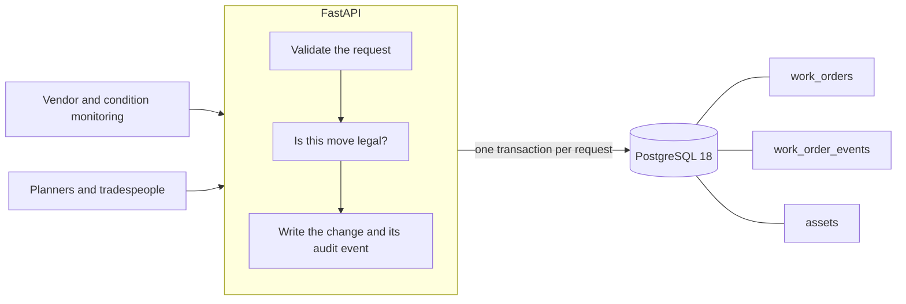

# FieldOps Work Order Bridge

**A work order API for a mining maintenance contractor: vendor and condition-monitoring systems raise faults across Pilbara sites, and this turns them into work orders that can only move through a fixed lifecycle, with every change recorded in the same database transaction that made it.**

Python 3.14 · FastAPI · SQLAlchemy 2 (async) · PostgreSQL 18 · Alembic · 93 tests against real PostgreSQL in CI



The state machine is the point. A work order moves `NEW → ASSIGNED → IN_PROGRESS → COMPLETED`, can be cancelled from any non-terminal status, and cannot be reopened. There is no generic `PATCH` that sets `status` — only named commands, each carrying the data that change requires. Every command writes an audit event in the same transaction as the change, so a work order cannot exist without a history and a rejected command leaves nothing behind. Why it is built that way is written up in [ADR-001](docs/adr/001-explicit-state-transitions.md).

## Quickstart

Needs only [uv](https://docs.astral.sh/uv/) and Docker. Verified from a clean clone.

```bash
uv sync                                  # install exact locked dependencies
docker compose up -d db                  # start PostgreSQL 18
uv run alembic upgrade head              # apply migrations to an empty database
uv run uvicorn app.main:app --reload     # API on http://127.0.0.1:8000
```

```bash
uv run pytest                            # 93 tests, needs the database up
```

Interactive API docs at http://127.0.0.1:8000/docs. Optionally, `uv run python -m scripts.seed --yes` replaces the contents of all three tables with ~50,000 work orders and ~185,000 events for query and index work.

## Three requests

**Raise a work order.** It always starts at `NEW`; `status` and `version` are not accepted from a client, so there is no way to create a work order that is already finished.

```bash
curl -X POST localhost:8000/work-orders -H 'Content-Type: application/json' \
  -d '{"asset_id":"2fe18926-5e1f-467b-b022-d79ce92479b4","title":"Lube return temperature high","priority":"HIGH"}'
```

```json
{
  "id": "debd1fa6-9b34-44f1-b549-ee6335a432ad",
  "asset_id": "2fe18926-5e1f-467b-b022-d79ce92479b4",
  "title": "Lube return temperature high",
  "priority": "HIGH",
  "status": "NEW",
  "version": 1,
  "assignee_id": null,
  "resolution": null,
  "created_at": "2026-08-11T11:43:55.869942Z"
}
```

**Try to start work nobody has been assigned to.** The state machine refuses, and says why.

```bash
curl -X POST localhost:8000/work-orders/debd1fa6-.../start -H 'Content-Type: application/json' -d '{}'
```

```json
{
  "code": "INVALID_STATE_TRANSITION",
  "message": "Cannot START a work order in status NEW.",
  "correlation_id": null
}
```

That is a `409`. `code` is what a client branches on; `message` is for whoever is reading the log.

**Ask what happened to it.** After assigning and starting, the history is the whole life of the work order — including the moment it was raised.

```bash
curl localhost:8000/work-orders/debd1fa6-.../events
```

```json
[
  { "event_type": "CREATE", "old_status": null,       "new_status": "NEW",         "work_order_version": 1 },
  { "event_type": "ASSIGN", "old_status": "NEW",      "new_status": "ASSIGNED",    "work_order_version": 2 },
  { "event_type": "START",  "old_status": "ASSIGNED", "new_status": "IN_PROGRESS", "work_order_version": 3 }
]
```

## What this demonstrates

- **A fixed state machine** as a pure function of `(command, current status)`, with no web or database imports, so the full 5×5 transition matrix is unit-tested without either
- **An audit event for every change**, written in the same transaction — verified by deleting the write and watching the tests fail, and by asking the database for orphans across 50,000 rows
- **Real PostgreSQL integration tests**, never SQLite: each test runs inside a transaction that is rolled back, using savepoints so request handlers still commit for real
- **Migrations own the schema** — Alembic only, no `create_all`, with CHECK constraints pinning the value domain so a manual `UPDATE` cannot introduce a status the application has never heard of
- **Skewed seed data** for query work: statuses lean on completed, a quarter of the crew holds ~70% of the jobs, timestamps span 18 months. On that data, filtering by status and priority reads 1,165 buffers without an index and 163 with one

Still to come: webhook signature verification and idempotency, JWT and role-based access control, optimistic concurrency, and an Azure deployment.

## How it is built

| Area | Choice |
|---|---|
| Transactions | One per request, owned by a dependency — business change and audit event commit or roll back together |
| Errors | `{code, message, correlation_id}` on every handled failure; unknown request fields are rejected, not ignored |
| Schema | Alembic migrations only; server-side defaults so the database is the single writer of record |
| Types | `mypy --strict` over `app`, `tests` and `scripts`, enforced in CI alongside Ruff and a migration smoke test |

Decisions are logged as they are made in [docs/interview-notes.md](docs/interview-notes.md) — including the ones that turned out to be wrong, and what testing them revealed. The product boundary and non-goals are in [PROJECT.md](PROJECT.md).

## References and attribution

Built from scratch; selected patterns referenced from:

- [rhoboro/async-fastapi-sqlalchemy](https://github.com/rhoboro/async-fastapi-sqlalchemy) — async session / transaction / test fixture patterns
- [rafsaf/minimal-fastapi-postgres-template](https://github.com/rafsaf/minimal-fastapi-postgres-template) — JWT, pytest and CI patterns
- [Azure-Samples/msdocs-fastapi-postgresql-sample-app](https://github.com/Azure-Samples/msdocs-fastapi-postgresql-sample-app) — App Service / OIDC deployment wiring

What was adopted versus rejected from each is documented as the project evolves.
